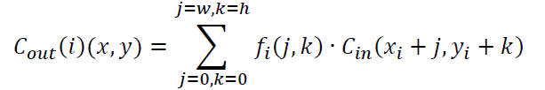
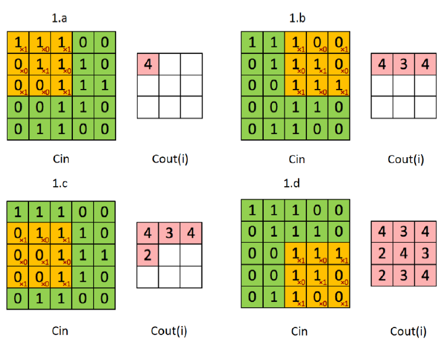

# ECS - Project
<h2>Implementation of a CNN Layer</h2>
<h3>Brief Description</h3>

  A Convolutional Neural Network (CNN) is a neural network typically used for object recognition in images. A convolutional layer is the part of this neural network in
  which a convolution operation between a matrix and a filter is performed. In particular, a convolutional layer is composed of:
  <ul>
    <li>1 input channel;</li>
    <li>N output channels. Each output channel is generated using an associated filter f(i) which belongs to R^(W×H).</li>
  </ul>
  Each element of 𝐶𝑜𝑢𝑡(𝑖) is calculated with the convolution between W×H elements of the input matrix and the W×H elements of the associated filter, f(i). The formula
  is the following:

  

    
  Notice that: the dimension of the filter matrix is smaller than the dimension of the input matrix. The convolution is applied to a submatrix of the input matrix. x_i
  and y_i are offsets in the input matrix which depend on the element of the output matrix to calculate.

<h3>Example</h3>

  

